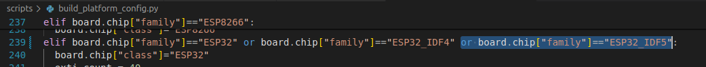
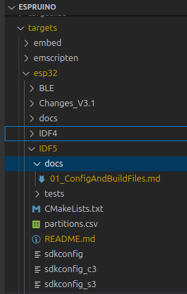

# Changes for idf v5 - build and configuration

## Environment

These changes are implemented in a Ubuntu (V24) environment.  
VScode is used as the IDE.  The espressif ESP-IDF Visual Studio Code Extension 
is installed but where it is used these notes should reflect this otherwise assume a standard VScode terminal is used.

## Changes for V5

### Board File

- A new board file boards/ESP32_IDF5.py  was added as a copy of ESP32_IDF4.PY
- family changed to ESP32_IDF5
- minimise/comment out the build libraries identified in the info section

```bash
info = {
 'name'                     : "ESP32",
 'espruino_page_link'       : 'ESP32',
 'default_console'          : "EV_SERIAL1",
 'default_console_baudrate' : "115200",
 'variables'                : 16383, # See note above 
 'io_buffer_size'           : 1024, # How big is the input buffer (in 4 byte words). Default is 256, but this makes us less likely to drop data
 'binary_name'              : 'espruino_%v_esp32.bin',
 'build' : {
   'optimizeflags' : '-Og',
   'libraries' : [
     'ESP32',
#    'NET',
#    'GRAPHICS',
#    'CRYPTO','SHA256','SHA512',
#    'TLS',
#    'TELNET',
#    'NEOPIXEL',
#    'FILESYSTEM',
#    'FLASHFS',
#    'BLUETOOTH'	 
   ],
```

### modify build_platform_config.py



### New targets subfolder

- Create a new target structure IDF5 in parallel with /targets/esp32/IDF4



- create docs and tests subfolders
- copy IDF4 files for sdkconfig_xx and partitions.csv

Note that a new set of V5 ESP32 target specific source files eg. jshardware.c will be created in ./esp32/IDF5.  Ie not using those in Espruino/targets/esp32. 

### Provision Scripts Changes

- provision.sh was modified to include a section for the board ESP32_IDF5.py

```bash
if [ "$PROVISION_ESP32_IDF5" = "1" ]; then
    echo ===== ESP32 IDF5
    # SDK
    if [ ! -d "esp-idf-5" ]; then
        echo installing esp-idf folder
        mkdir esp-idf-5
        cd esp-idf-5
        git clone -b v5.2.2 --recursive https://github.com/espressif/esp-idf.git
        esp-idf/install.sh   # not specifying the target
        cd ..
    fi
    source esp-idf-5/esp-idf/export.sh
fi
```

Provision for building in ESP-IDF v5 can now be run from a terminal in the Espruino folder with:

```bash
>  source ./scripts/provision.sh ESP32C3_IDF5 
```

## make files

- Espruino/makefile is modified to use the family 

```bash
else ifeq ($(FAMILY),ESP32_IDF5)
USE_ESP32=1
```

- the make file Espruino/make/family ESP32_IDF5.make is created as a copy of ESP32_IDF4.make.  
- the make file Espruino/make/targets ESP32_IDF5.make is created as a copy of ESP32_IDF4.make.  

## Building Espruino (not working yet)

Open a terminal from the espruino top directory and execute

```bash
> BOARD=ESP32_IDF5 RELEASE=1 make flash BINDIR=. 
or
> BOARD=ESP32_IDF5 DEBUG=1 make flash BINDIR=. 
```
